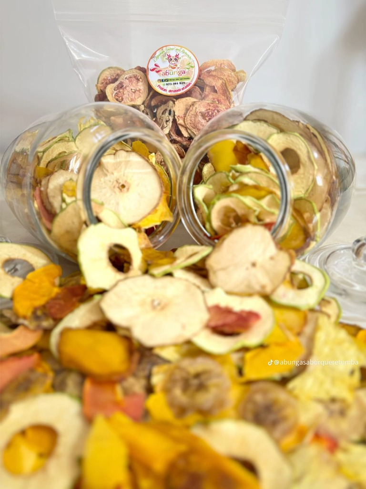

# 🍎 Abunga - Snacks Saludables

**Abunga** es una aplicación web de comercio electrónico moderna diseñada para la venta de frutas deshidratadas y snacks saludables. El proyecto destaca por su diseño vibrante, experiencia de usuario fluida y una interfaz totalmente responsiva optimizada para dispositivos móviles.



## 🚀 Características Principales

### 🏠 Página de Inicio (Home)

- Diseño atractivo con imágenes de alta calidad (Misión, Visión, Hero).
- Navegación intuitiva hacia el catálogo.

### 🛍️ Catálogo de Productos

- **Filtro Dinámico**: Filtra por "Tipo" (Rollos, Fruta) y por fruta específica.
- **Experiencia Móvil Mejorada**:
  - Barra de filtros colapsable superior ("Filtros").
  - Sección "Arma aquí tu mixto" integrada en la lista móvil.
- **Detalle de Producto (Modal)**:
  - Vista rápida con selección de peso (50gr / 100gr).
  - Diseño adaptativo: Vista de columna en móvil (Imagen arriba, datos abajo) y fila en escritorio.

### 🍓 Arma tu Mixto

- Herramienta interactiva para crear un mix personalizado.
- Selección de hasta 5 frutas diferentes.
- Cálculo de precio automático según el tamaño elegido.

### 🛒 Carrito de Compras

- Gestión de estado global con **Zustand**.
- Persistencia de datos (el carrito no se pierde al recargar).
- Diseño móvil optimizado: Lista de productos horizontal, controles de cantidad compactos y header personalizado para estados vacíos.

## 🛠️ Tecnologías Utilizadas

- **React**: Biblioteca principal de UI.
- **Vite**: Entorno de desarrollo y construcción rápido.
- **Tailwind CSS**: Estilizado utility-first para un diseño responsivo y moderno.
- **Zustand**: Gestión de estado ligero y potente (Carrito, Productos).
- **React Router DOM**: Navegación SPA (Single Page Application).
- **Radix UI**: Primitivas accesibles para componentes interactivos (Acordeones, Diálogos).
- **Lucide React**: Iconografía moderna y limpia.

## 📦 Instalación y Uso

1.  **Clonar el repositorio**:

    ```bash
    git clone https://github.com/tu-usuario/react-abunga.git
    cd react-abunga
    ```

2.  **Instalar dependencias**:

    ```bash
    npm install
    ```

3.  **Iniciar el servidor de desarrollo**:

    ```bash
    npm run dev
    ```

4.  **Construir para producción**:
    ```bash
    npm run build
    ```

## 📱 Diseño Responsivo

El proyecto ha sido cuidadosamente ajustado para ofrecer una experiencia nativa en móviles:

- **Headers consistentes**: Altura y visibilidad de logo unificadas.
- **Navegación táctil**: Botones y controles de tamaño adecuado.
- **Layouts adaptables**: Cambio inteligente entre grids (PC) y listas/stacks (Móvil).

---
